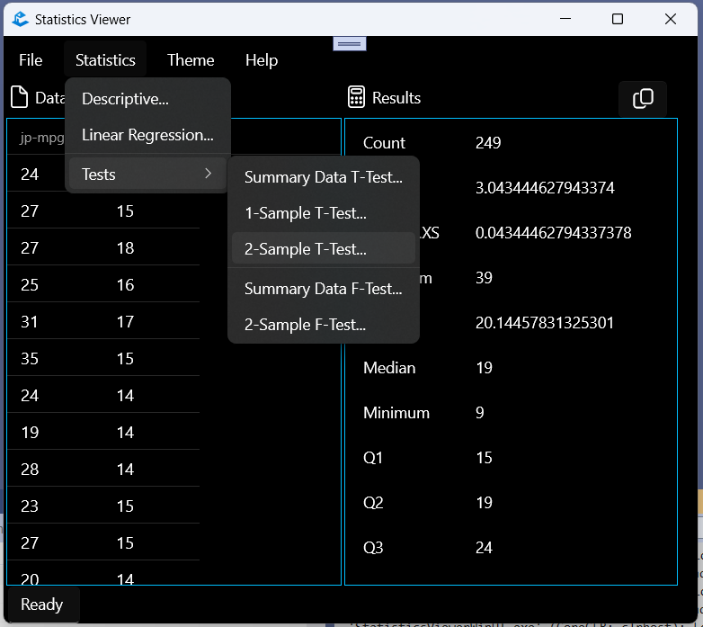
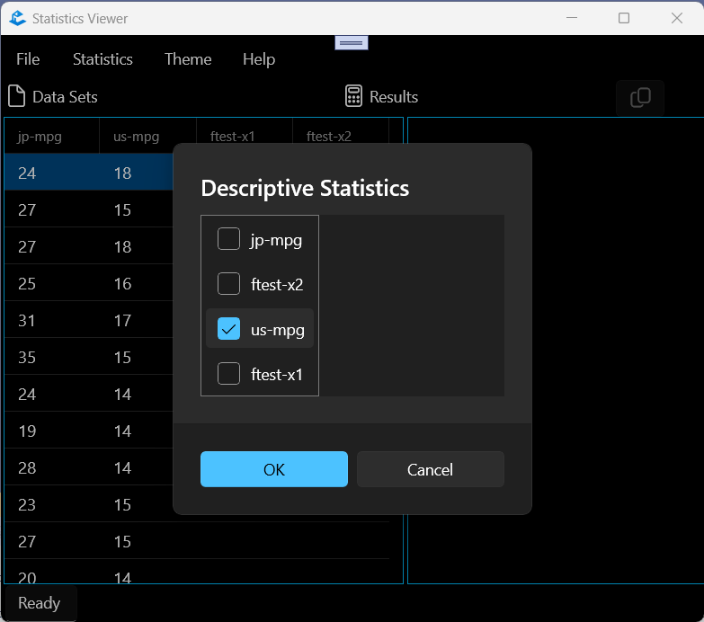
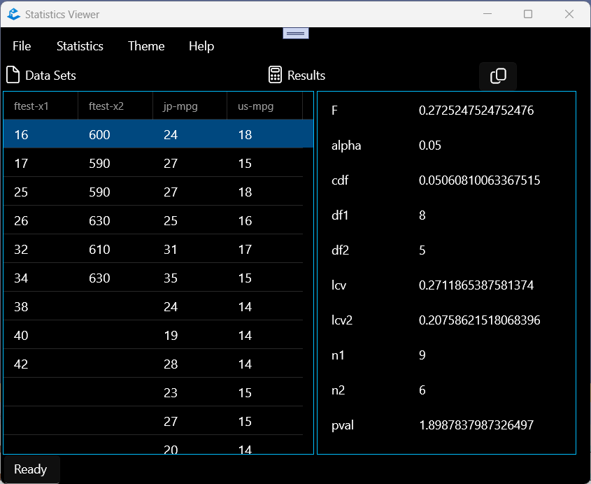

<!-- PROJECT LOGO -->
 

  

  <h3 align="center">StatisticsViewer</h3>

  

     
    <a href="https://github.com/Adam-Gladstone/SoftwareInteroperability"><strong>Explore the docs �</strong></a>
     
     
    <a href="https://github.com/Adam-Gladstone/SoftwareInteroperability/issues">Report Bug</a>
    �
    <a href="https://github.com/Adam-Gladstone/SoftwareInteroperability/issues">Request Feature</a>
  

<!-- TABLE OF CONTENTS -->

  
Table of Contents

  <ol>
    <li>
      <a href="#about-the-project">About The Project</a>
      <ul>
        <li><a href="#projects">Projects</a></li>
        <li><a href="#built-with">Built With</a></li>
      </ul>
    </li>
    <li>
      <a href="#getting-started">Getting Started</a>
      <ul>
        <li><a href="#prerequisites">Prerequisites</a></li>
        <li><a href="#installation">Installation</a></li>
      </ul>
    </li>
    <li><a href="#usage">Usage</a></li>
    <li><a href="#roadmap">Roadmap</a></li>
    <li><a href="#license">License</a></li>
    <li><a href="#contact">Contact</a></li>
    <li><a href="#acknowledgments">Acknowledgments</a></li>
  </ol>

<!-- ABOUT THE PROJECT -->
## About The Project
The StatisticsViewer project is part of a series of projects exploring XAML, C#, UWP & WinUI, and C++ WinRT.

The __StatisticsViewerWinUI__ application is a port of the original StatsViewer Windows MFC Application.
The purpose of this application is to demonstrate component interoperability. The application uses a Windows Runtime Component (*StatisticsLibraryWRC*) that wraps a native C++ statistics library offering simple descriptive statistics and statistical hypothesis tests. The component stack is described in the [StatisticsLibrary project](https://github.com/Adam-Gladstone/SoftwareInteroperability).

(<a href="#readme-top">back to top</a>)

### Projects
The StatisticsViewer solution consists of two projects.

#### StatisticsConsole
The StatisticsConsole is a minimal C# console application that is used to check that the StatisticsLibraryWRC component can be referenced correctly via packages rather than directly in the project dependencies. It also checks that the StatisticsLibraryWRC can be used to run some simple test functions.

#### StatisticsViewerWinUI
The __StatisticsViewerWinUI__ is the windows desktop application that makes use of the functionality provided by the *StatisticsLibraryWRC*. The usage is described below.

(<a href="#readme-top">back to top</a>)

### Built With

* Visual Studio 2022
* C# (targeting .NET 6.0)
* WinUI3

The following packages are required:
- CommunityToolkit.Mvvm 8.2.1
- CommunityToolkit.WinUI.UI.Controls.DataGrid 7.1.2
- Microsoft.Extensions.DependencyInjection 7.0.0
- Microsoft.NETCore.UniversalWindowsPlatform  6.2.14
- Microsoft.Windows.CsWinRT 2.0.3
- Microsoft.Windows.SDK.BuildTools  10.0.25188-preview
- Microsoft.Windows.AppSDK  1.4.230913002
- StatisticsLibraryWRC  0.1.0-prerelease

(<a href="#readme-top">back to top</a>)

<!-- GETTING STARTED -->
## Getting Started
The project can be downloaded from the GitHub repository in the usual way.

### Prerequisites
See the packages listed above.

### Installation
There are no specific installation instructions. Ensure that the NuGet package manager package sources has an entry pointing to the location of the StatisticsLibraryWRC.

(<a href="#readme-top">back to top</a>)

<!-- USAGE EXAMPLES -->
## Usage
The StatisticsViewer is a Windows desktop application that performs descriptive statistics and statistical tests on selected data sets.

This application is written in C# and uses WinUI3 controls.
It demonstrates:
- data binding to a DataGrid control
- data binding to a ListView control
- a simple traditional menu bar
- dialog boxes based on content dialog
- a tailored MVVM architecture

Open the application, and select File, Open. Choose one of the data files from .\SoftwareInteroperability\Data (e.g. jp-mpg.txt) and open it. The data are displayed in the list on the left-hand side. 

Repeat with the following data sets: us-mpg.txt, ftest-x1.txt, ftest-x2.txt. These are added to the display (and to the underlying data manager).

From the Statistics menu, select Descriptive. The Descriptive Statistics dialog box is displayed with a list of available datasets for which this request can be made.  

.

Select `us-mpg` and press OK. The summary desriptive statistics are displayed in the Results panel on the right-hand side. These can be copied to the clipboard.

From the Statistics menu, select Two-sample FTest. The Two-sample FTest dialog box is displayed with a list of available datasets for which this request can be made.  Select the x1 and x2 datasets and press OK.

The results of the two-sample F-test are displayed.

Select File > Exit to close the application.

(<a href="#readme-top">back to top</a>)

<!-- ROADMAP -->
## Roadmap
Future directions:
- [ ] Add Changelog

See the [open issues](https://github.com/Adam-Gladstone/SoftwareInteroperability/issues) for a full list of proposed features (and known issues).

(<a href="#readme-top">back to top</a>)

<!-- LICENSE -->
## License
Distributed under the GPL-3.0 License. See `LICENSE.md` for more information.

(<a href="#readme-top">back to top</a>)

<!-- CONTACT -->
## Contact
Adam Gladstone - (https://www.linkedin.com/in/adam-gladstone-b6458b156/)
Project Link: [StatisticsViewer](https://github.com/Adam-Gladstone/SoftwareInteroperability)

(<a href="#readme-top">back to top</a>)

<!-- ACKNOWLEDGMENTS -->
## Acknowledgments
Helpful resources

* [Choose an Open Source License](https://choosealicense.com)
* [Img Shields](https://shields.io)
* [GitHub Pages](https://pages.github.com)
* [Font Awesome](https://fontawesome.com)
* [React Icons](https://react-icons.github.io/react-icons/search)

(<a href="#readme-top">back to top</a>)

<!-- PROJECT SHIELDS -->

[![Issues][issues-shield]][issues-url]
[![GPL-3 License][license-shield]][license-url]
[![LinkedIn][linkedin-shield]][linkedin-url]

<!-- MARKDOWN LINKS & IMAGES -->
<!-- https://www.markdownguide.org/basic-syntax/#reference-style-links -->

[issues-shield]: https://img.shields.io/github/issues/Adam-Gladstone/SoftwareInteroperability.svg?style=for-the-badge
[issues-url]: https://github.com/Adam-Gladstone/SoftwareInteroperability/issues

[license-shield]: https://img.shields.io/github/license/Adam-Gladstone/SoftwareInteroperability.svg?style=for-the-badge
[license-url]: https://github.com/Adam-Gladstone/SoftwareInteroperability/LICENSE.md

[linkedin-shield]: https://img.shields.io/badge/-LinkedIn-black.svg?style=for-the-badge&logo=linkedin&colorB=555
[linkedin-url]: https://www.linkedin.com/in/adam-gladstone-b6458b156/
