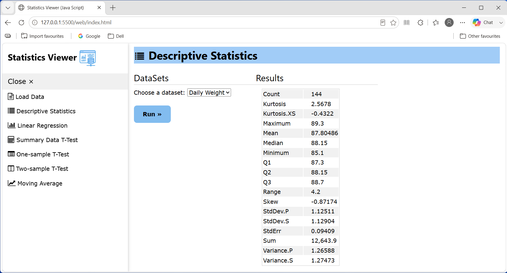
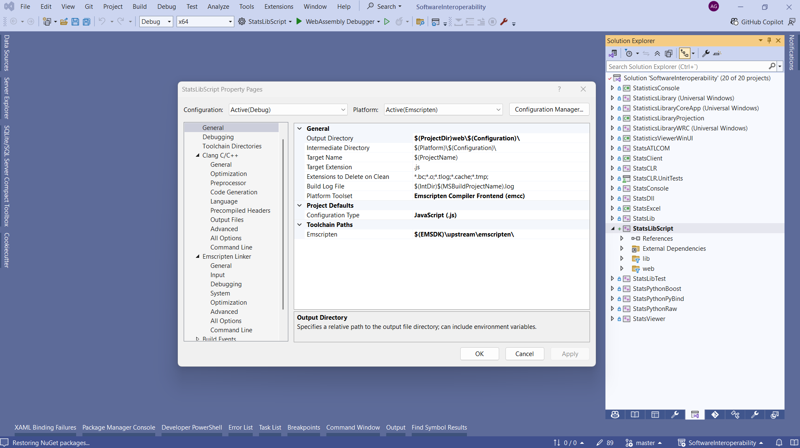
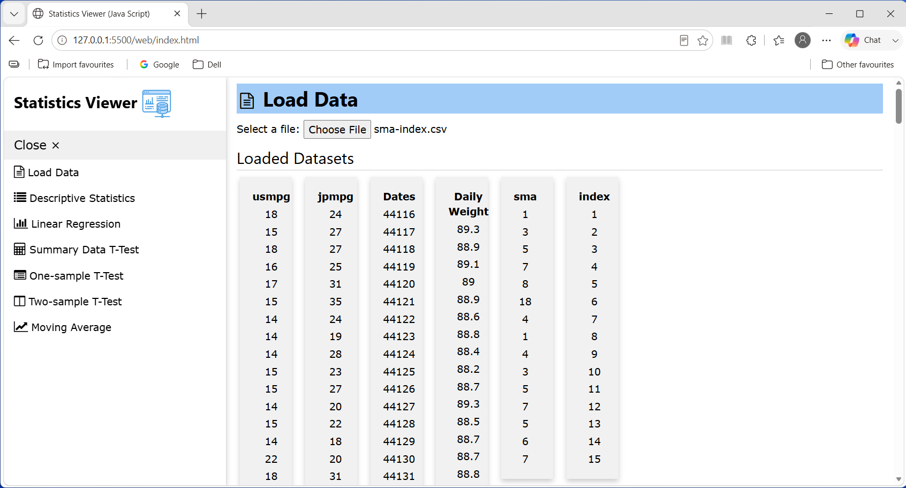
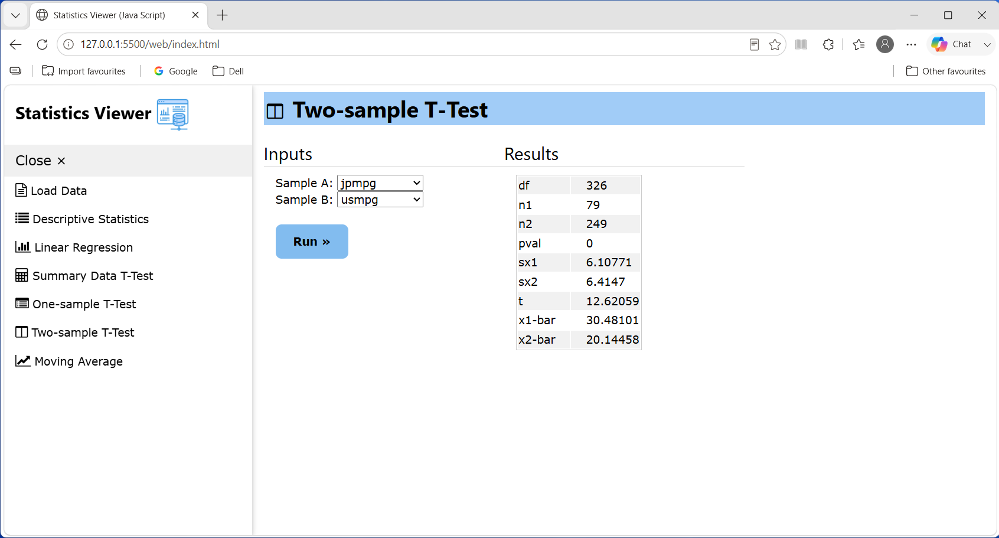
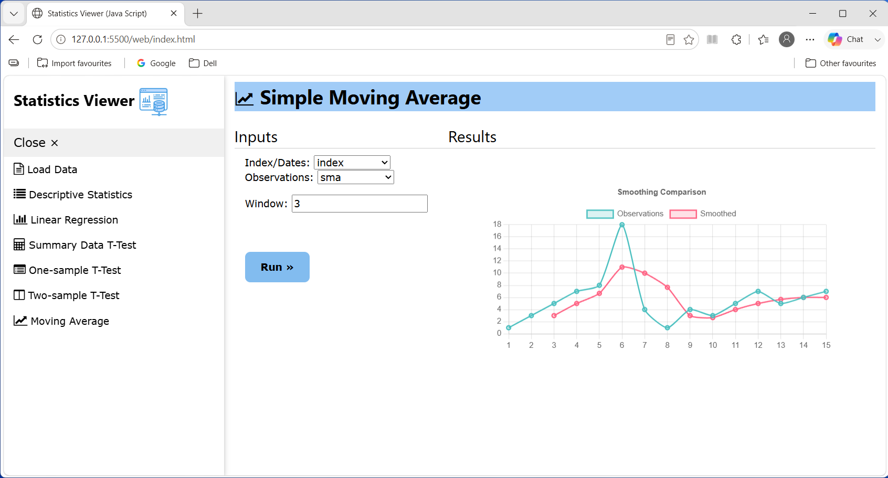

<a name="readme-top"></a>

<!-- PROJECT LOGO -->
<br />
<div align="center">
  <a href="https://github.com/Adam-Gladstone/SoftwareInteroperability/">
    
  </a>

  <h3 align="center">StatisticsLibrary</h3>

  <p align="center">
    <br />
    <a href="https://github.com/Adam-Gladstone/SoftwareInteroperability"><strong>Explore the docs »</strong></a>
    <br />
    <br />
    <a href="https://github.com/Adam-Gladstone/SoftwareInteroperability/issues">Report Bug</a>
    ·
    <a href="https://github.com/Adam-Gladstone/SoftwareInteroperability/issues">Request Feature</a>
  </p>
</div>

<!-- TABLE OF CONTENTS -->
<details>
  <summary>Table of Contents</summary>
  <ol>
    <li>
      <a href="#about-the-project">About The Project</a>
      <ul>
        <li><a href="#project">Project</a></li>
        <li><a href="#built-with">Built With</a></li>
      </ul>
    </li>
    <li>
      <a href="#getting-started">Getting Started</a>
      <ul>
        <li><a href="#prerequisites">Prerequisites</a></li>
        <li><a href="#installation">Installation</a></li>
      </ul>
    </li>
    <li><a href="#usage">Usage</a></li>
    <li><a href="#roadmap">Roadmap</a></li>
    <li><a href="#license">License</a></li>
    <li><a href="#contact">Contact</a></li>
    <li><a href="#acknowledgments">Acknowledgments</a></li>
  </ol>
</details>

<!-- ABOUT THE PROJECT -->
## About The Project
This project - *StatsLibScript* - follows on from previous projects that I have worked on in the area of [Software Interoperability](https://github.com/Adam-Gladstone/SoftwareInteroperability). In this case, I wanted to use a reasonably non-trivial C++ library (*StatsLib*) in a web application that uses a basic HTML/CSS/JavaScript stack. The intention, as on previous occasions, was to see how feasible (and easy or otherwise) it was to build a component to do this. The use-case is to provide access to any C++ functionality and make it available in a browser (hence cross-platform), and more specifically to JavaScript.

Unlike the previous Windows-centric projects (C# front end, Windows Forms or WinUI3.0 and for the 'bridging' layer: C++/CLI or a [Windows Runtime Component](https://github.com/Adam-Gladstone/SoftwareInteroperability/blob/master/README-StatisticsLibrary.md)), I had no prior knowledge of how to accomplish this. There are various approaches to doing this somewhat dependent on whether the C++ component is to be used on the client or the server side. For the server-side, I had already tried a RESTful API service using Flask that connects to a [Python wrapper around StatsLib](https://github.com/Adam-Gladstone/SoftwareInteroperability/blob/master/StatsPython/StatsService.py). However, in this case, I wanted the *StatsLib* functionality to be available on the client-side, through a browser.

It turns out that this is possible by compiling the C++ code to [WebAssembly](https://webassembly.org/). *emscripten* provides all the necessary [tools](https://emscripten.org/docs/index.html) to manage this. It is also well-documented. The end-result is a simple web application that makes use of some of the facilities provided by *StatsLib*.



<p align="right">(<a href="#readme-top">back to top</a>)</p>

### Project
*StatsLibScript* consists of a single project. The StatsLibScript folder is divided into \lib and \web sub-folders. The \lib folder contains the sources and the \web folder contains the web application. 

#### The StatsLibScript Component
The \lib folder contains the C++ code that is compiled into wasm. This consists broadly of the [emscripten bindings](https://emscripten.org/docs/porting/connecting_cpp_and_javascript/embind.html) and auxilliary classes/functions that help with the communication between C++ and JavaScript.

The auxilliary classes/functions are:
- Conversion.h/Conversion.cpp

  This is where we locate any functions needed to convert between native C++ (and STL) types and types understood by JavaScript/Wasm. The only conversion of interest concerns the results returned from StatsLib functions. In general these are returned as a ```std::unordered_map<std::string, double>```. However, even after registering this type, wasm did not appear to 'process' it. As far as I could tell, there is no template defined for this ```MapType``` in ```bind.h```. Therefore, we wrote a conversion to a ```std::map<std::string, double>```. An earlier version of the component made use of ```emscripten::val v``` which allows converting JavaScript types to C++. However, these turned out not to be needed as the bindings specified in ```module.cpp``` (see below) worked directly.

- Functions.h/Functions.cpp

  This contains all the function wrappers which are called through the bindings.

- Classes.h/Classes.cpp

  This contains proxy classes for the DataManager, TTest and ZTest classes of *StatsLib*. These are not strictly necessary if the C++ types can be registered (or for classes where the specific functionality is not exposed). But with functionality like ```DataManager::ListDataSets``` we needed to convert from ```std::vector<DataSetInfo>``` to the registered 'VectorString' type i.e. ```std::vector<std::string>```. Similarly, to handle the results coming back from TTest and ZTest classes we convert to the registered 'MapStringDouble' type i.e. ```std::map<std::string, double>```.

- module.cpp

  This contains the main module with the emscripten bindings. The macro ```EMSCRIPTEN_BINDINGS(my_module)``` contains the definitions of the bindings. These are the functions that JavaScript will call and the classes that can be used. 

In detail, first off, we register vector and map types. This allows us to use these types in JavaScript, e.g. 

``` 
let xs = new Module.VectorDouble();
xs.push_back(0.0);
xs.push_back(1.0);
...
```

This vector can be passed directly to C++ functions/classes. We can also iterate over the values and convert to a JavaScript array:

```
let arr = new Array(xs.size()).fill(0).map((_, id) => xs.get(id));
console.log("DataSet: ", arr);
```

The module also defines the functions we want to overload. For example, we declare an overload of the ```DescriptiveStatistics``` function in case we want to restrict the results to specific values, as follows:

```
let keys = new Module.VectorString()
keys.push_back("Mean");
keys.push_back("StdDev.S");

const results = Module.DescriptiveStatistics(xs, keys)

console.log("Mean: ", results.get(keys.get(0)));
console.log("StdDev.S: ", results.get(keys.get(1)));
```

We also declare an enumerated type mapped to the underlying C++ type that can be used in JavaScript:

```
console.log("Standard Deviation (Population): ", Module.StandardDeviation(xs, Module.VarianceType.Population));
console.log("Standard Deviation (Sample): ", Module.StandardDeviation(xs, Module.VarianceType.Sample));
```

Finally, we define the wrapper classes in terms of constructors and functions. The ```DataManager``` class takes a simple constructor, followed by a number of functions. The ```TTest/ZTest``` wrappers both have multiple constructors. Emscripten only seemed to be able to differentiate based on the number of arguments and not their different types.

For example, 
```
.constructor<double, double, double, double>()                          // 4 args - OK
.constructor<double, const std::vector<double>&>()                      // 2 args - double and vector
.constructor<const std::vector<double>&, const std::vector<double>&>()  // 2 args - vector and vector
```

When calling this from JavaScript, it does not distinguish the case of 2 args. To work around this we added a dummy initial third argument, which is not ideal.

Depending on the exact requirements of the C++ library that is being exposed, there is a lot more that can be done. This is covered in the [*emscripten documentation*](https://emscripten.org/docs/porting/connecting_cpp_and_javascript/embind.html). This project only just scratches the surface.

The \web folder contains the web infrastructure and the debug and release build outputs. There is a single ```index.html``` file and a stylesheet (```styles.css```). ```index.html``` contains the main code to load the ```StatsLibScript.js``` module. We reference the compiled ```StatsLibScript.js``` in the ```script``` element and use the ```Module.onRuntimeInitialized``` function. An alternative is to fetch the wasm code directly.

The web application consists of a left-hand side collapsible menu. The main page content consists of sections referenced by the navigation menu. Each section consists of a left-hand panel that contains inputs (typically dataset(s) and/or single values) and a ```Run>> ``` button. The right-hand panel is used to display the outputs (typically a table, but for the Moving Average we use a graph).

#### Building the project
There are three ways in which the project can be built: all three depend on having *emscripten* installed. Further details can be found in: [Build Commands.md](StatsLibScript/Build%20Commands.md). 

##### Method 1 - emcc
This is the easiest and most direct. It is a single command line that builds the .wasm and .js outputs. It is easy to adapt some of the parameters (like the compiler optimisation levels). However, in a complex project a more structured approach is needed.

##### Method 2 - CMake
CMake provides a somewhat more structured approach to building the outputs especially if the project is more complex than a few input files. However, there are a large number of [command line parameters](https://emscripten.org/docs/tools_reference/settings_reference.html) and it is not always obvious what their (combined) effect is. As an approach, keeping it simple worked for me. We only use these three: 
```
-sENVIRONMENT=web 
-sNO_DISABLE_EXCEPTION_CATCHING 
--no-entry
```

##### Method 3 - Visual Studio Emscripten project template 
A project template for Emscripten is available for Visual Studio [emscripten template](https://marketplace.visualstudio.com/items?itemName=KamenokoSoft.emscripten-build-support). This made it very easy to integrate the StatsLibScript project into the SoftwareInteroperability solution. 
The build configuration is simple: compiler settings and linker settings.

.

In all cases the outputs are a ```StatsLibScript.wasm``` and a ```StatsLibScript.js``` file. The latter is referenced directly in the ```index.html``` script element.

<p align="right">(<a href="#readme-top">back to top</a>)</p>

### Built With
* Visual Studio 2022
* C++20
* emscripten

<p align="right">(<a href="#readme-top">back to top</a>)</p>

<!-- GETTING STARTED -->
## Getting Started
The project can be downloaded from the GitHub repository in the usual way.

### Prerequisites
* Boost 1.91
* emscripten emcc 5.0.7, clang version 23.0.0

### Installation
* The project requires an installation of emscripten: https://emscripten.org/docs/index.html

<p align="right">(<a href="#readme-top">back to top</a>)</p>

<!-- USAGE EXAMPLES -->
## Usage
The first thing to do is to load some data sets into the DataManager. A dataset is a single .csv file with a column of data and a heading. The heading is used as a dataset name. There are a number of examples in the SoftwareInteroperability\Data directory.



Here we see a screenshot after four datasets have been loaded.

Then, depending on the dataset, we can choose Descriptive Statistics, Linear Regression, TTests, or Moving Average. Select the appropriate dataset(s) and press 'Run'. The results are shown in a table on the right-hand side.






<p align="right">(<a href="#readme-top">back to top</a>)</p>

<!-- ROADMAP -->
## Roadmap
Future directions:
- [ ] Add Changelog

See the [open issues](https://github.com/Adam-Gladstone/SoftwareInteroperability/issues) for a full list of proposed features (and known issues).

<p align="right">(<a href="#readme-top">back to top</a>)</p>

<!-- LICENSE -->
## License

Distributed under the GPL-3.0 License. See `LICENSE.md` for more information.

<p align="right">(<a href="#readme-top">back to top</a>)</p>

<!-- CONTACT -->
## Contact

Adam Gladstone - (https://www.linkedin.com/in/adam-gladstone-b6458b156/)

Project Link: [SoftwareInteroperability](https://github.com/Adam-Gladstone/SoftwareInteroperability)

<p align="right">(<a href="#readme-top">back to top</a>)</p>

<!-- ACKNOWLEDGMENTS -->
## Acknowledgments

Helpful resources

* [Choose an Open Source License](https://choosealicense.com)
* [Img Shields](https://shields.io)
* [GitHub Pages](https://pages.github.com)
* [Font Awesome](https://fontawesome.com)
* [React Icons](https://react-icons.github.io/react-icons/search)

<p align="right">(<a href="#readme-top">back to top</a>)</p>

<!-- PROJECT SHIELDS -->

[![Issues][issues-shield]][issues-url]
[![GPL-3 License][license-shield]][license-url]
[![LinkedIn][linkedin-shield]][linkedin-url]

<!-- MARKDOWN LINKS & IMAGES -->
<!-- https://www.markdownguide.org/basic-syntax/#reference-style-links -->

[issues-shield]: https://img.shields.io/github/issues/Adam-Gladstone/SoftwareInteroperability.svg?style=for-the-badge
[issues-url]: https://github.com/Adam-Gladstone/SoftwareInteroperability/issues

[license-shield]: https://img.shields.io/github/license/Adam-Gladstone/SoftwareInteroperability.svg?style=for-the-badge
[license-url]: https://github.com/Adam-Gladstone/SoftwareInteroperability/LICENSE.md

[linkedin-shield]: https://img.shields.io/badge/-LinkedIn-black.svg?style=for-the-badge&logo=linkedin&colorB=555
[linkedin-url]: https://www.linkedin.com/in/adam-gladstone-b6458b156/
